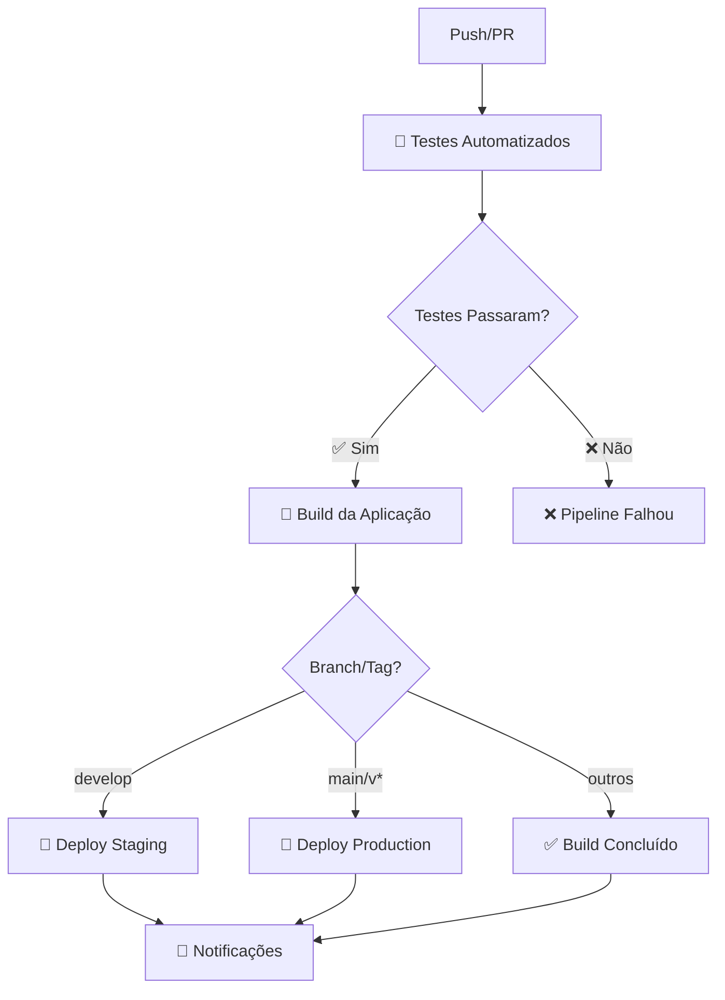

# 🚀 Pipeline de Deploy EyeDock

Este documento descreve o pipeline completo de deploy do EyeDock, incluindo testes automatizados, build e deploy para diferentes ambientes.

## 📋 Visão Geral

O pipeline de deploy do EyeDock é composto por 5 jobs principais:

1. **🧪 Testes Automatizados** - Executa testes unitários e análise estática
2. **🔨 Build da Aplicação** - Constrói APK/AAB para diferentes ambientes
3. **🚀 Deploy Staging** - Deploy para Firebase App Distribution
4. **🚀 Deploy Production** - Deploy para Google Play Store
5. **📧 Notificações** - Relatórios e notificações de status

## 🔄 Fluxo do Pipeline



## 🧪 Job 1: Testes Automatizados

### O que faz:
- ✅ Executa análise estática (Lint, Detekt, KtLint)
- ✅ Executa testes unitários
- ✅ Gera relatório de cobertura
- ✅ Verifica qualidade dos testes
- ✅ Upload de resultados para Codecov

### Gatilhos:
- Push para `main` ou `develop`
- Pull Request para `main` ou `develop`
- Manual via `workflow_dispatch`

### Saídas:
- Relatórios de teste em HTML
- Relatório de cobertura JaCoCo
- Upload para Codecov

## 🔨 Job 2: Build da Aplicação

### O que faz:
- ✅ Constrói APK de debug
- ✅ Constrói AAB de release (se main/tag)
- ✅ Upload de artifacts

### Dependências:
- Job de testes deve ter sucesso

### Saídas:
- `debug-apk-{run_id}` - APK de debug
- `release-aab-{run_id}` - AAB de release (se aplicável)

## 🚀 Job 3: Deploy Staging

### O que faz:
- ✅ Download do APK de debug
- ✅ Deploy para Firebase App Distribution
- ✅ Notificação de sucesso

### Gatilhos:
- Branch `develop`
- Manual com `environment=staging`

### Configuração:
- Firebase App ID
- Firebase Service Account Key
- Grupo de testers

## 🚀 Job 4: Deploy Production

### O que faz:
- ✅ Download do AAB de release
- ✅ Configuração de keystore
- ✅ Build de AAB assinado
- ✅ Deploy para Google Play Store
- ✅ Upload de mapping file

### Gatilhos:
- Branch `main`
- Tags `v*`
- Manual com `environment=production`

### Configuração:
- Android Keystore (codificado em base64)
- Google Play Service Account Key
- Package name: `com.eyedock.app`

## 📧 Job 5: Notificações

### O que faz:
- ✅ Gera relatório de deploy
- ✅ Notifica sucesso/falha
- ✅ Upload de relatório final

### Execução:
- Sempre executa (`if: always()`)
- Depende de todos os jobs anteriores

## 🔧 Configuração

### Secrets Necessários:

#### Android Keystore:
```bash
ENCODED_KEYSTORE=<keystore_base64>
KEYSTORE_PASSWORD=<senha_keystore>
KEY_ALIAS=<alias_chave>
KEY_PASSWORD=<senha_chave>
```

#### Firebase:
```bash
FIREBASE_APP_ID=<app_id>
FIREBASE_SERVICE_ACCOUNT_KEY=<json_key>
```

#### Google Play:
```bash
GOOGLE_PLAY_SERVICE_ACCOUNT_KEY=<json_key>
```

### Como Configurar:
1. Vá para Settings > Secrets and variables > Actions
2. Adicione cada secret com o nome e valor correspondente
3. Consulte `.github/SECRETS_SETUP.md` para detalhes

## 🎯 Ambientes

### Staging (Desenvolvimento)
- **Branch**: `develop`
- **Deploy**: Firebase App Distribution
- **Artefato**: APK de debug
- **Testers**: Grupo interno

### Production (Produção)
- **Branch**: `main` ou tags `v*`
- **Deploy**: Google Play Store
- **Artefato**: AAB assinado
- **Track**: Internal (inicialmente)

## 📊 Monitoramento

### Métricas Coletadas:
- ✅ Taxa de sucesso dos testes
- ✅ Cobertura de código
- ✅ Tempo de execução
- ✅ Status de deploy

### Relatórios Gerados:
- Relatório de testes em HTML
- Relatório de cobertura JaCoCo
- Relatório de deploy em Markdown
- Upload para Codecov

## 🚨 Troubleshooting

### Problemas Comuns:

#### 1. Testes Falhando
```bash
# Verificar localmente
./gradlew :app:testDebugUnitTest --info

# Verificar logs do GitHub Actions
# Verificar relatórios de teste
```

#### 2. Build Falhando
```bash
# Verificar dependências
./gradlew dependencies

# Verificar configuração
./gradlew assembleDebug
```

#### 3. Deploy Falhando
- Verificar secrets configurados
- Verificar permissões das contas
- Verificar configuração do Firebase/Google Play

### Logs Úteis:
- GitHub Actions logs
- Firebase Console logs
- Google Play Console logs

## 🔄 Workflows Disponíveis

### 1. `deploy.yml` - Pipeline Completo
- Executa todos os jobs
- Deploy automático
- Configurável via inputs

### 2. `quick-test.yml` - Testes Rápidos
- Apenas testes unitários
- Sem deploy
- Execução rápida

### 3. `ci.yml` - CI Tradicional
- Análise estática
- Testes instrumentados
- Build de release

### 4. `test-suite.yml` - Suite Completa
- Testes funcionais
- Testes de regressão
- Testes de performance

## 📈 Melhorias Futuras

### Planejadas:
- [ ] Testes de integração
- [ ] Testes de UI automatizados
- [ ] Deploy para TestFlight (iOS)
- [ ] Notificações via Slack/Discord
- [ ] Rollback automático
- [ ] Blue-green deployment

### Em Consideração:
- [ ] Deploy canário
- [ ] Feature flags
- [ ] A/B testing
- [ ] Monitoramento de crash
- [ ] Analytics de uso

## 📞 Suporte

Para dúvidas ou problemas:

1. **Documentação**: Consulte este arquivo e `.github/SECRETS_SETUP.md`
2. **Logs**: Verifique os logs do GitHub Actions
3. **Teste Local**: Execute os comandos localmente primeiro
4. **Issues**: Abra uma issue no repositório

---

**🎉 Pipeline configurado e pronto para uso!**
